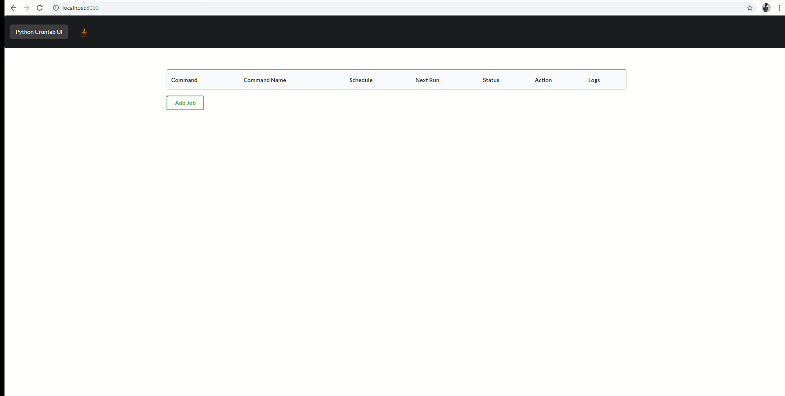
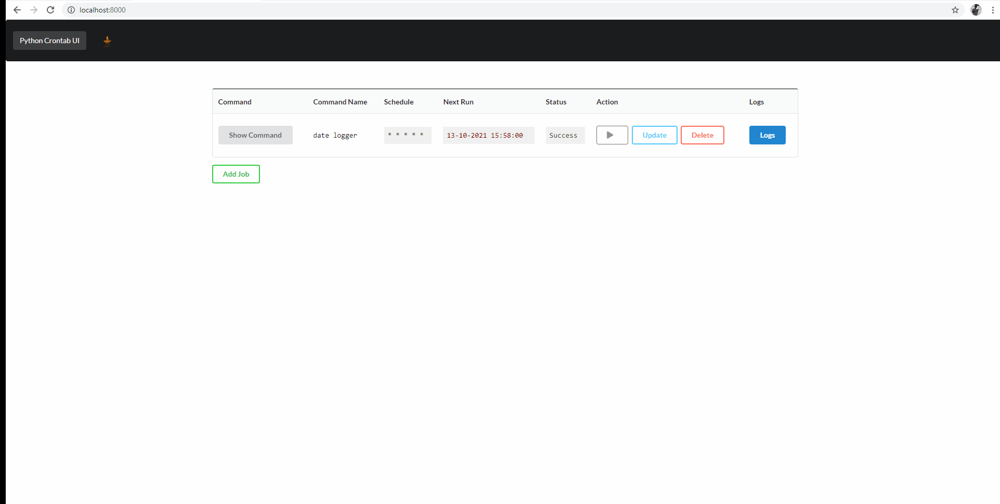

# Python Crontab UI
*Sponsored by: https://www.facebook.com/lacantinasueno/*


This project aims to simplify managing cron jobs. Common issues that we encounter in cron are:

- Jobs are failing silently.
- Manually editing `crontab` is error prone.

# Features:

- Adding, Updating, Deleting and running cron jobs is simple.
- It automatically logs the output of your cron jobs. This can be viewed in the WEB UI.
- Displays when is the next scheduled run.
- Validates if your schedule is a valid cron schedule.
- Displays if your cron job is succesful or if it failed *(experimental)*

# Demo

A full video tutorial can be found here:

## Executing a succesful command



## Updating a job and running a failed command



## *Scheduling a Jupyter Notebook*

Refer to this video:

# Quickstart

Start the server by running the following commands.

```bash
https://github.com/benjcabalona1029/python-crontab-ui.git
cd python-crontab-ui-git
python3 -m venv venv
source venv/bin/activate
pip install -r requirements.txt
uvicorn main:app
```
# Notes
- This installs the cron jobs using the current OS user.
- You should use a **unique command name**. This is used in filtering the cron jobs.
- The log files are installed in your home directory.
    - The filename of the stdout log is `name.log` where `name` is the command name that you choose in the UI, removing all spaces.
    - The filename of the stderr log is `error_name.err`
- The implementation for the status indicator is quite simple, we have a `watch_err_files` function that checks if there are any
contents in  stderr log. If there are, it will display the status as failed.
**Once you're able to debug the issue, delete the stderr file**

# TODO:

- Improve the UI. I'm not really good at HTML/CSS/JS. I mean, it is usable but it could be better.
